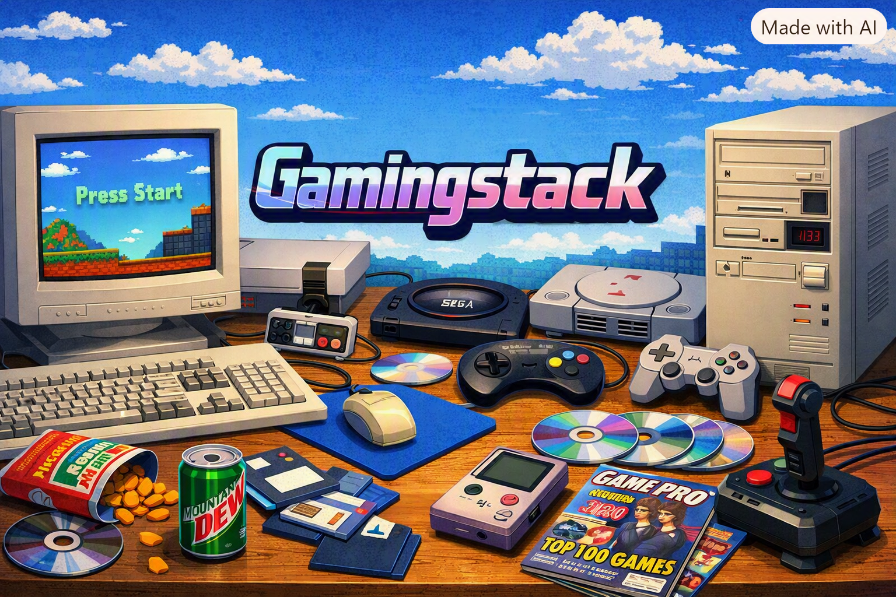

# GamingStack

[](LICENSE)


[](CHANGELOG.md)

A fully automated, over-the-top retro-styled Windows 11 gaming setup app.
Boots through a fake BIOS screen (pulling your *real* CPU/RAM/GPU/disk info),
into an original Win95-inspired boot animation, onto a desktop, then opens a
terminal window that installs a full gaming/streaming app stack and applies
gaming tweaks — all in one self-contained app, no scripts or extra files to
lose. Download it, run it, walk away.

## Features

- **Fake BIOS POST screen** — genuinely reads your CPU, RAM, GPU and disks
  and displays them like a real boot screen, including an animated memory
  count-up with tick beeps
- **Original retro boot animation** — gradient sky, drifting pixel clouds,
  and an animated waving flag (all original artwork — no real Windows
  assets are used, see [Credits & copyright](#credits--copyright))
- **Desktop stage** with a taskbar (live clock), desktop icons, and a
  wallpaper
- **Interactive install wizard**, running inside a terminal window that
  animates open: shows the full app list grouped under a heading per
  category, typed out Resident Evil save-point style with a mechanical
  typewriter tick, then asks whether to install everything, pick items one
  by one, or bail out — see [How the install works](#how-the-install-works)
  below
- **Real installer**: installs the selected apps via `winget` with
  retries, silently installs every VC++ Redistributable version as one
  bundled entry, handles a few apps that need manual download/install,
  and applies a few gaming-related tweaks (Game Mode, hardware-accelerated
  GPU scheduling, High Performance power plan)
- **Install summary** at the end of a run — totals plus a per-item
  installed/failed/skipped breakdown, grouped by category, with a
  plain-English reason next to anything that failed or was skipped (known
  winget outcomes like "already installed and up to date" are translated
  out of raw exit codes rather than shown as a mystery failure)
- **Full install log** written to disk every run (path shown on the
  summary screen) — every line the terminal window shows, not just failures
- **Fake shutdown outro** — a Windows 9x-style shutdown sequence plays
  after the install summary, ending on the classic "It's now safe to turn
  off your computer" screen, before moving on to the sign-off
- **Achievement toasts** — small pop-ups (First Blood, Completionist,
  Redistributable Rampage, Already Perfect, Not Everything's Meant To Be,
  Speedrunner) fire during a run the moment their real condition is met,
  with a tracker on the summary screen showing which ones you've earned
  across the session
- **Easter eggs** — press <kbd>Delete</kbd> during the BIOS screen for a
  joke blue screen, decline every install option in the wizard for a small
  surprise, or find the hidden classic cheat code for a throwaway joke toast
- Runs as a single self-contained `.exe` — no separate files to install
  alongside it

## How the install works

Once the boot sequence finishes, the terminal window shows the full list
of what's on offer and asks:

1. **Install everything shown above? [Y/N]** — `Y` installs the full list.
   `N` moves to the next question.
2. **Would you like to choose what's installed? [Y/N]** — `Y` walks
   through every item one at a time (`Y` installs it, `N` skips it),
   showing a running checklist as you go. `N` moves to the next question.
3. **Just want to quit? [Y/N]** — `Y` closes the app. `N` leads to a
   small easter egg, then the same sign-off screen you'd see after a
   real install.

After a real install run, the summary screen leads into a fake shutdown
sequence before the sign-off screen — press any key to move past the
summary, the rest plays itself out.

## What it installs

The wizard groups everything under a heading per category:

- **Game Launchers** — Steam, Epic, GOG, Ubisoft Connect, Battle.net,
  Amazon Games, Discord, Playnite to tie the launchers together
- **Monitoring & Performance** — NVIDIA App, HWiNFO, CPU-Z, Speccy,
  CrystalDiskInfo, Process Lasso, Razer Cortex (direct download - no winget
  package exists for it)
- **Streaming & Recording** — Streamlabs Desktop, Medal.tv, Voicemeeter
  Banana
- **General Utilities** — VS Code, PowerShell 7, Microsoft 365 Apps,
  PowerToys, Python 3, VLC, 7-Zip, Vortex Mod Manager
- **Redistributables** — a single "VC++ Redistributables Pack" entry that
  silently installs every VC++ runtime version (2005 through 2015+, x86
  and x64) in one go, since so many games and creator apps quietly expect
  one of these already being present
- **RGB & Peripheral Control** — Corsair iCUE, Razer Synapse, OpenRGB (a
  single open-source app that talks to several vendors' hardware at once,
  handy if you don't want four separate vendor apps running), plus Hyte
  Nexus and L-Connect 3

The full list — and how to change it — is the `Catalog` in
`InstallerEngine.cs`.

Apps with no reliable `winget` package (Razer Cortex, Hyte Nexus,
L-Connect 3) are downloaded and installed directly instead, but sit in
the same pickable list as everything else so you can skip them if you
don't own that hardware.

## Requirements

- Windows 10/11 (this uses WinForms and WMI, so it's Windows-only)
- [`winget`](https://apps.microsoft.com/detail/9nblggh4nns1) (App Installer)
  — comes preinstalled on current Windows 11
- [.NET 8 SDK](https://dotnet.microsoft.com/download/dotnet/8.0) if you're
  building it yourself
- Admin rights — the app requests elevation on launch (needed for the
  install/tweak stage)

## Getting started

```bash
git clone <this-repo-url>
cd <cloned-folder>
dotnet restore
dotnet run
```

Press **Esc** at any point to close the window while testing, or
**Delete** during the BIOS screen for the easter egg.

> **Debugging note:** `dotnet run`/F5 use a Debug-only manifest that does
> *not* request admin rights (`App.Debug.manifest`) — this is intentional.
> Requesting elevation from a debug launch throws "the requested operation
> requires elevation", because `dotnet run` starts the app via
> `CreateProcess`, which can't silently elevate a child process the way
> double-clicking an .exe can. Registry tweaks will just no-op/fail
> gracefully in Debug as a result. To test the real elevated behavior,
> either run a Release publish (below) or launch VS Code itself as
> Administrator before running.

### Building a standalone .exe

```bash
dotnet publish -c Release -r win-x64
```

The output lands in `bin\Release\net8.0-windows\win-x64\publish\` as a
single self-contained executable, using the real `App.manifest`
(`requireAdministrator`) — double-clicking it triggers the UAC prompt as
expected.

## Roadmap

- [x] Retro boot sequence (BIOS, boot animation, desktop, terminal)
- [x] Real installer stack (winget loop, manual installer fallback, tweaks)
- [x] Interactive install wizard (install all / pick individually / quit)
- [x] Installation summary screen
- [x] Fake "shutting down" outro
- [x] Achievement toast notifications
- [x] Konami code easter egg
- [ ] Real boot animation assets (currently original placeholder artwork)

## Safety note

This app requests admin rights and will install applications and modify
registry settings on your machine. Test it in a VM or a spare machine
before running it on anything you care about, and review the app list in
`InstallerEngine.cs` before running it on your own PC.

## Credits & copyright

The retro aesthetic here is inspired by classic BIOS boot screens and
Windows 9x, but every visual asset (the logo, the flag animation, the
clouds, the icons, the BSOD easter egg text) is original artwork made for
this project — no Microsoft logos, boot animations, or copyrighted assets
are included or redistributed. The banner image above and the desktop
wallpaper are AI-generated.

## License

[MIT](LICENSE) — do what you like with it.
